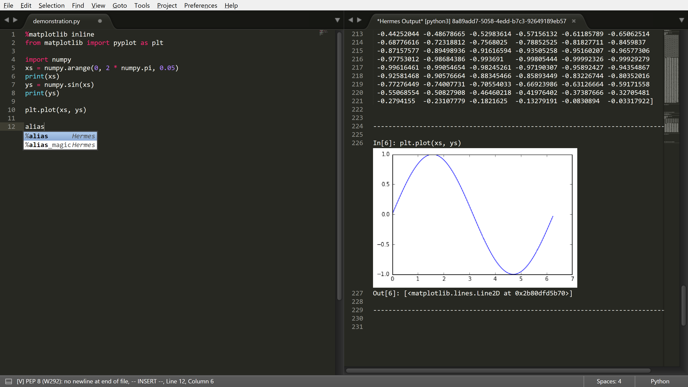

Helium package for Sublime Text 3
===

Helium is a package for Sublime Text 3, which provides in-editor code execution and autocomplete in interaction with Jupyter kernels.
The concept of an editor extension communicating Jupyter kernels is inspired by @nteract's splendid Atom package [Hydrogen](https://github.com/nteract/Hydrogen). I want something like it in Sublime Text 3, too.

Any feedback is highly welcome. I hope this package will help your life with ST3!

## Installation

Now this package is under the package control channel!

You can install it with Package Control plugin, run `Package Control: Install Package`, then choose `Helium` from the package list.

## Usage

### Connecting to Jupyter kernels

#### 1. The most basic way, start a kernelspec installed locally, as a subprocess of ST3 (the process stops when Sublime stops)

  1. Run `Helium: connect kernel` command.
  2. Choose `New kernel`.
  3. Choose the kernelspec you want to run.

#### 2. Connect to the kernel already runnning and connected to Helium

  1. Run `Helium: connect kernel` command.
  2. Choose the kernel you want to connect.

#### 3. Connect to a kernel already running under some other Jupyter app (such as Notebook)

  1. Get connection info of the kernel. The way to get connection info differ among kernels, see the doc of each kernel (in ipython kernel, you can get it by `%connect_info` magic.)
  2. Run `Helium: connect kernel` command.
  3. Choose `New kernel`.
  4. Choose `(Enter connection info)`.
  5. Enter the connection info (Helium accepts a path or connection info itself).

#### 4. Connect to a kernel already running under some other Jupyter app, in a SSH server

  1. Configure SSH servers in the setting file (opened by `Helium: Settings` command.)
  2. Get connection info of the kernel. The way to get connection info differ among kernels, see the doc of each kernel (in ipython kernel, you can get it by `%connect_info` magic.)
  3. Run `Helium: connect kernel` command.
  4. Choose `New kernel`.
  5. Choose `(Connect remote kernel via SSH)`.
  6. Choose the server, then enter the connection info.

#### Using Python kernel installed via Conda

Python kernel installed via Conda is not found by Jupyter by default. You should add the path to kernel into the `jupyter_path` entry of the config file.

### Execution

Execute code by `Helium: Execute Block` (whose command name is `helium_execute_block`).

#### Code cell

Regions surrounded by `# %%` or `# <codecell>` (you can configure it in `cell_delimiter_pattern` option item) are considered as "code cells".

You can execute a region by `Helium: Execute cell` (`helium_execute_cell`) or `Helium: Execute Cell and Move` command.
Each cell has a clickable "Run Cell" phantom that appears next to the cell markers to run the cell.

### Object inspection

Get Object Inspection by `Helium: Get Object Inspection` (whose command name is `helium_get_object_inspection`).

### Autocomplete

You should be able to get autocomplete from the kernel from the time you connected. If you don't want autocomplete, set `"complete"` as `false` in setting file.

### Other kernel manipulations

You can restart, shutdown, and interrupt process via `Helium: Restart Kernel`, `Helium: Shutdown Kernel`, `Helium: Interrupt Kernel` commands.

You can also run these command as a submenu of `Helium: List Kernels` command.

## Motivation of development

### Why using Jupyter?

We can execute code, retrieve results including images, get completions and object inspections by the Jupyter protocol regardless of the interpreter implementation of languages if it has Jupyter kernel.
If we try to do that by directly running interpreters there should be several interpreter-specific problems, but we can entrust the kernel maintainers on language-specific problems by using Jupyter.

### Why not using Jupyter Notebook?

I admit Jupyter Notebook is a powerful tool for instantly sharing small analysis work, exploring data or APIs, or making executable tutorials. Yes, I often use it, too.
However, in my opinion, it is not suited for projects with large code bases.
I want to jumpt across files instantly, make modules organized (not saved as `.ipynb`s), kick scripts with various parameters, and make project code more reusable and reproducible... but still I want to edit them with interactive feedback.
